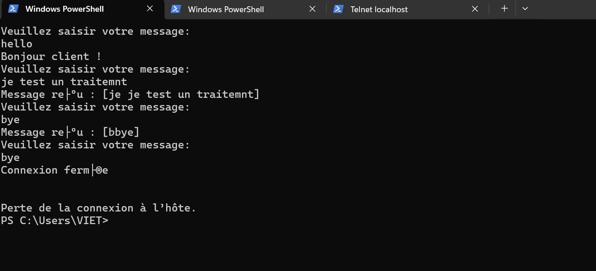
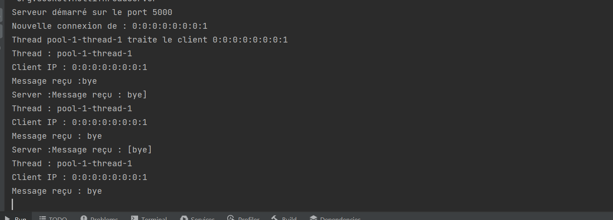

# Serveur TCP multi-thread (`org.socket`)

Petit serveur d’écho et de commandes sur **TCP**, port **5000**, avec un pool fixe de **5** threads pour traiter les clients en parallèle.

## Fichiers

| Classe | Rôle |
|--------|------|
| `MultiThreadServer` | Ouvre `ServerSocket`, accepte les connexions, délègue chaque socket à `ClientHandler` via un `ExecutorService`. |
| `ClientHandler` | Lit les lignes envoyées par le client, répond ligne par ligne, ferme le socket à la fin. |


## Tester avec un client

 avec **telnet** :

```bash
telnet localhost 5000
```



Les clients en surplus sont placés dans une file d’attente interne (FIFO), et ils sont traités dès qu’un des 5 threads du pool devient disponible.


Le serveur envoie d’abord : `Veuillez saisir votre message:` puis attend une ligne par interaction.

## Commandes reconnues (insensible à la casse)

| Saisie | Réponse du serveur |
|--------|--------------------|
| `hello` | `Bonjour client !` |
| `time` | Date et heure au format `dd/MM/yyyy HH:mm:ss` |
| `bye` | `Connexion fermée` puis fermeture |
| *(autre texte)* | `Message reçu : [votre texte]` |

Après chaque réponse, le serveur renvoie à nouveau `Veuillez saisir votre message:`.

## Notes

- Les messages côté console serveur (connexion, IP, thread, messages reçus) sont en français, comme dans le code.
- En cas de déconnexion brutale ou d’erreur I/O, le handler affiche `Client déconnecté` et ferme le socket.

